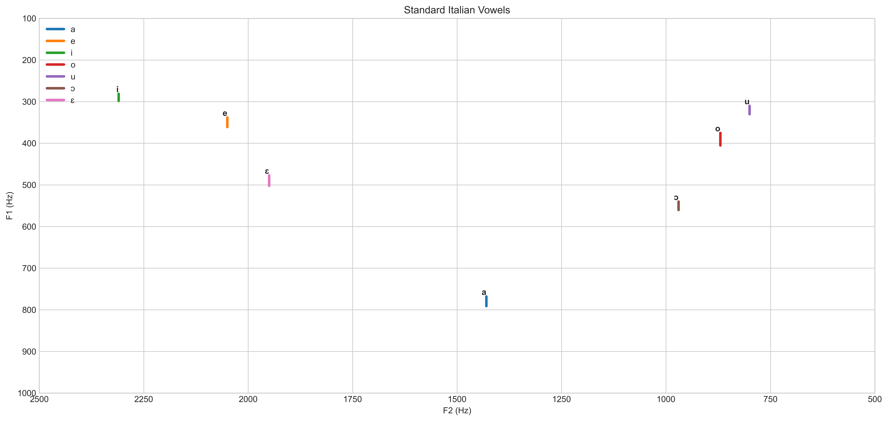

# Description

This script enables a [vowel chart](https://en.wikipedia.org/wiki/IPA_vowel_chart_with_audio) to be plotted for a given speaker. It works with both diphthongs and monophthongs.

It is a Python re-implementation of [Listen Lab's make_vowel_space](https://github.com/ListenLab/make_vowel_space/). Functional Changes:

- Updated to allow processing of IPA symbols.
- Removed the latin abbreviation to IPA conversion in order to make it applicable to a wider range of applications.
- Added the functionality to batch process files.
- Made the script more robust to Praat output issues.
- Consistent graph scaling to allow comparison across speakers / studies.

An example use case is given below. Comparing the two images, you can very quickly tell that most of my Italian vowels are _very roughly_ in the right place but my `u` vowel is out of place and my `e` vowel has a bit of a glide to it. Note for those comparing their own vowels: the exact frequencies vary depending on the individual speaker's voice and cultural background ([interesting video here](https://www.youtube.com/watch?v=TWRB443YrHI)). Therefore, you should be comparing the relative shape of the chart instead of the exact frequencies.

My vowels:

Standard Italian vowels:

# Basic Instructions

1. Download [this repository](https://github.com/jonathanfox5/plot_vowel_space/archive/refs/heads/main.zip) and extract it.

2. Install required python modules:
   `pip install -r requirements.txt`

3. Create a [Praat](https://www.fon.hum.uva.nl/praat/) TextGrid and label each of the vowels with a note of your choosing in a single tier. This label could be an IPA symbol, lexical set word or any other unique label that you like. If you are unsure of how to do this, the [tutorial for the original script](https://www.youtube.com/watch?v=BGW8J4cG0qY) is a good place to start. If you are struggling to get good formant tracking, [this video](https://www.youtube.com/watch?v=fsGIecMgTzQ) is a good reference.

4. Within Praat, run the `Extract_formants.praat` script within this repository. Make sure to update the following line (that is near the top of the script) to match the name of your TextGrid and Formant objects:
   `name$ = "name_of_your_object"`

5. Save the generated formant table as csv within the `data` subfolder of this repository.

6. Update the paths and settings at the top of `build_plots.py` using a text editor. If you find that parts of your graph are cut off, you will need to tweak the axis scaling variables `X_SCALE` (representing formant 2) and `Y_SCALE` (representing formant 1).

7. Run the python scripts using:
   `python build_plots.py`

8. A `.png` file will have been generated within the `data` directory. If it looks messy, it's very likely that your formant settings are incorrect in Praat or that the TextGrid boundaries need tweaking. Go back to Step 3 and try again!

# Generating chart from formant frequency data

If you have a set of formant frequencies, you can generate a plot without the use of Praat.

1. Open [examples/build_formant_table_from_numbers.xlsx](examples/build_formant_table_from_numbers.xlsx)
2. Update the frequencies on the sheet `vowel_data`
3. If you don't have a variance from your dataset, just set this to 50. The purpose is to make sure that there is a visible line since the script plots with markers disabled.
4. F3 isn't used by the script. It is just included for compatibility with the original `Extract_formants.praat`.
5. Check the sheet `csv_output` doesn't have any obvious errors and export it to `.csv` with a name of your choice. You can then follow the basic instructions from step 6.

# Other Resources

- Geoff Lindsey's [video](https://www.youtube.com/watch?v=FdldD0-kEcc) titled "Vowel Space" explains the relationship between formant frequency and vowels extremely well.
- ListenLab's [channel](https://www.youtube.com/@listenlab_umn) has lots of information on speech acoustics and Praat.
