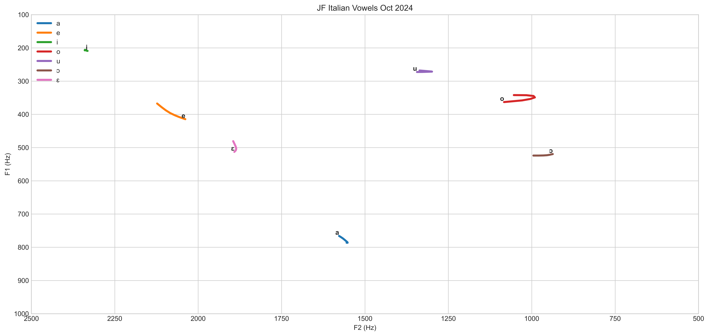

# Description

This script enables a [vowel chart](https://en.wikipedia.org/wiki/IPA_vowel_chart_with_audio) to be plotted for a given speaker. It works with both diphthongs and monophthongs.

It is a Python re-implementation of [Listen Lab's make_vowel_space](https://github.com/ListenLab/make_vowel_space/). Functional changes:

- Updated to allow processing of IPA symbols.
- Removed the latin abbreviation to IPA conversion in order to make it applicable to a wider range of applications.
- Added the functionality to batch process files.
- Made the script more robust to Praat output issues.
- Consistent graph scaling to allow comparison across speakers / studies.

An example use case is given below. Comparing the two images, you can very quickly tell that most of my Italian vowels are _very roughly_ in the right place but my `u` vowel is out of place and my `e` vowel has a bit of a glide to it. Note for those comparing their own vowels: the exact frequencies vary depending on the individual speaker's voice and cultural background ([interesting video here](https://www.youtube.com/watch?v=TWRB443YrHI)). Therefore, you should be comparing the relative shape of the chart instead of the exact frequencies.

My vowels:

Standard Italian vowels:

# Video Tutorial

Coming soon!

# Basic Instructions

The following instructions assume that you have [Praat](https://www.fon.hum.uva.nl/praat/) installed and that you have basic familiarity with it. If not, there are plenty of tutorials that you can read / watch.

1. Download [this repository](https://github.com/jonathanfox5/plot_vowel_space/archive/refs/heads/main.zip) and extract it.

2. Open a terminal / [command window](https://www.howtogeek.com/789662/how-to-open-a-cmd-window-in-a-folder-on-windows/) in the folder where your extracted the files. Type the following to install the required python modules:
   `pip install -r requirements.txt`

3. Import your recording or record directly into Praat.

   - If you are doing it in English, there are some reference lists and carrier phrases in the `data` directory.
   - It's best to use consistent consonants around the vowels that you are wishing to analyse as different consonants can affect the quality of your vowel in different ways.

4. Within Praat, create a TextGrid and label each of the vowels with a note of your choosing in a single tier. This label could be an IPA symbol, lexical set word or any other unique label that you like. If you are unsure of how to do this, the [tutorial for the original script](https://www.youtube.com/watch?v=BGW8J4cG0qY) is a good place to start.

   - [This](examples/example_text_grid.png) is an example of what a labelled vowel in the text grid should look like.
   - While in here, you should check that Praat is highlighting your formants correctly. It's likely that you will have to update the settings.
   - For my own (male) voice, I have mostly been using 4200 Hz, 4 formants and a 0.04s window for my formant settings.
   - My formants for `o` are very close in value and Praat can struggle to separate them. Increasing formants to 5 can fix it at the cost of messing up the higher order formants. Since we only need F1 and F2, that's not an issue for this script.
   - If you are struggling to get good formant tracking, [this video](https://www.youtube.com/watch?v=fsGIecMgTzQ) is a good reference.

5. In the main Praat window, create a formant object from the sound file.

   - Click on the sound item, "Analyse Spectrum" then "To Formant (burg)". [Image for reference](examples/example_create_formant_object.png)
   - Enter the formant settings that you used in the previous step into the window that appears. Hit OK.
   - Rename the new formant object to match the name of your TextGrid.

6. Within Praat, run the `Extract_formants.praat` script (this is one of the files that was included in the zip file that you extracted earlier). Make sure to update the following line (that is near the top of the script) to match the name of your TextGrid and Formant objects, making sure to **keep** the quotation marks:
   `name$ = "name_of_your_object"`

7. Save the generated formant table as a `csv` (comma separated values) file within the `data` subfolder of this repository.

8. Update the paths and settings at the top of `build_plots.py` using a text editor. If you find that parts of your graph are cut off, you will need to tweak the axis scaling variables `X_SCALE` (representing formant 2) and `Y_SCALE` (representing formant 1).

9. Go back to the terminal / command window that you opened in step 2 (or open a new one in the folder where you extracted the files). Run the python script using:
   `python build_plots.py`

10. A `.png` file will be generated within the `data` subfolder. If the chart looks messy, it's very likely that your formant settings are incorrect in Praat or that the TextGrid boundaries need tweaking. Go back to Step 3 and try again!

# Generating chart from formant frequency data

If you have a set of formant frequencies, you can generate a plot without the use of Praat.

1. Open [examples/build_formant_table_from_numbers.xlsx](examples/build_formant_table_from_numbers.xlsx)
2. Update the frequencies on the sheet `vowel_data`.
3. If you don't have a variance from your dataset, just set this to 50. The purpose is to make sure that there is a visible line since the script plots with markers disabled.
4. F3 isn't used by the script. It is just included for compatibility with the original `Extract_formants.praat`.
5. Check the sheet `csv_output` doesn't have any obvious errors and export it to `.csv` with a name of your choice. You can then follow the basic instructions from step 5.

# Other Resources

- Geoff Lindsey's [video](https://www.youtube.com/watch?v=FdldD0-kEcc) titled "Vowel Space" explains the relationship between formant frequency and vowels extremely well.
- ListenLab's [channel](https://www.youtube.com/@listenlab_umn) has lots of information on speech acoustics and Praat.
